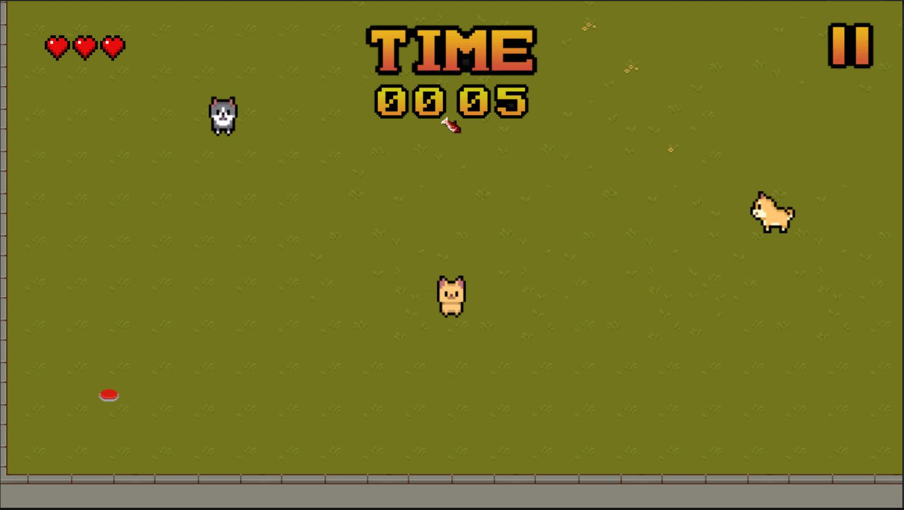
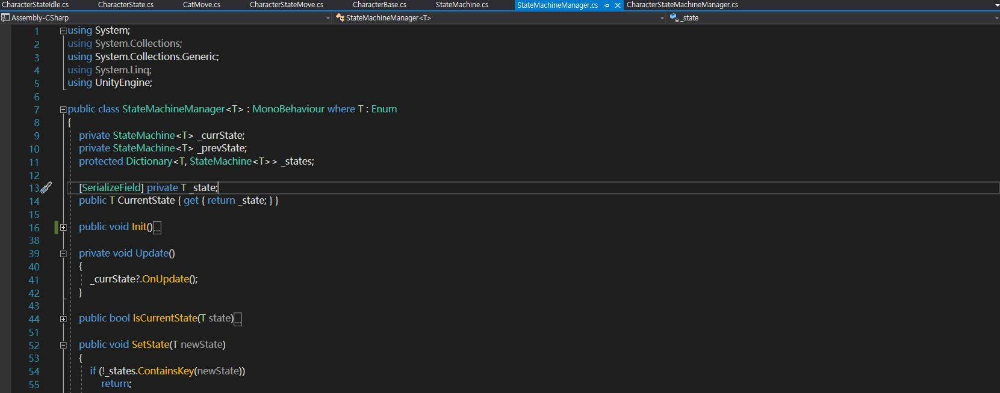
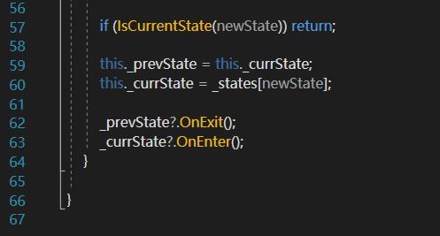
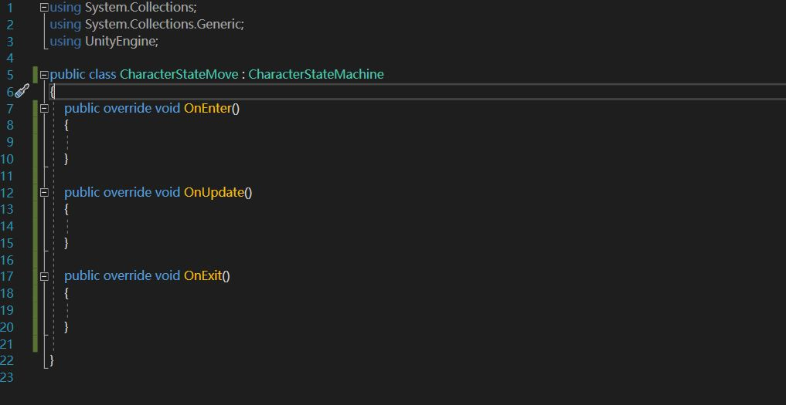
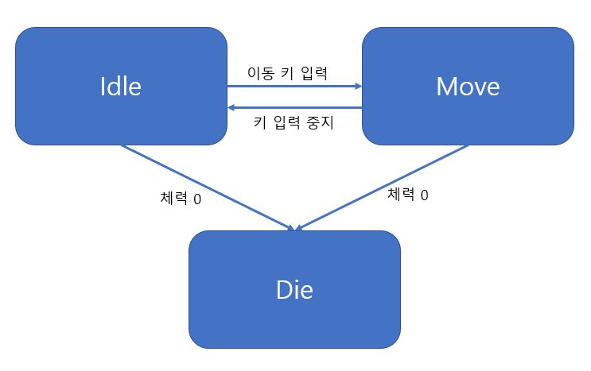

[1.컨셉](#컨셉)  
[2.관련 이미지, 동영상](#관련-소스)  
[3.구성요소](#구성-요소)   
[4.게임 시스템 디자인](#게임-시스템-디자인)  
[- a. 피라미터](#피라미터)  
[- b. 행동](#행동)  
[- c. 게임의 규칙](#게임의-규칙)  
[- d. 게임에서 사용될 공식](#게임에서-사용될-공식)  
[5. 개발 요구사항 & 흐름도](#개발-요구사항)  
[6. 개발작업 일정](#개발작업-일정)  
[7. 주차별 개발 내용](#주차별-개발-내용)   
[- 1주차](#1주차)  
[- 2주차](#2주차)  
[- 3주차](#3주차)  
[- 4주차](#4주차)  
[- 5주차](#5주차)  
[- 6주차](#6주차)  
# 컨셉
## 메인컨셉
- 탄막 액션 게임
- 날라오는 몬스터를 피해 높은 점수를 기록한다

### 서브컨셉 : 동물
- 귀여운 동물 캐릭터를 이용해 플레이어들에게 친근감을 준다

### 서브컨셉 : 액션
- 다가오는 몬스터를 피하고 회피 기술을 이용해 점수를 올린다

  
# 관련 소스

## [동영상](https://www.youtube.com/watch?v=t5eI7-wIsv0)

  
# [대표 이미지]

  
# 구성 요소

##  메커니즘
- 플레이어가 캐릭터를 조종, 몬스터를 피해 살아남는다
- 몬스터와 부딪힐 시 생명력 차감

 

## 재미요소
- 여러 가지 아이템과 미션을 이용해 부가 점수를 얻을 수 있음
- 랭킹 시스템을 통한 경쟁

 

## 미적요소
- 2D 도트 그래픽을 이용한 맵 구성
- 주인공 등 여러 캐릭터의 디자인을 직접 구현함
- 플레이어에게 긴장감을 줄 수 있는 노래와 효과음 삽입

# 게임 시스템 디자인   

## 오브젝트

연번 | 오브젝트 이름 | 오브젝트 이미지
---- | ---- | ----
1 |주인공| 
2 |아이템| 
3 |몬스터| 
4 |보스 몬스터| 
5 |하트| 
6 |음식| 
7 |NPC| 

## 피라미터

## 1)오브젝트 이름 : 플레이어

속성 | 속성값 | 설명 
---- | ---- | ----
이름 | 개쩌는 고양이 | 플레이어가 조종하는 캐릭터

 
 
## 2)오브젝트 이름 : 아이템

속성 | 속성값 | 설명 
---- | ---- | ----
 도움 아이템 | 쉴드 | 주변 적들을 없애주는 게임 아이템

## 3)오브젝트 이름 : 몬스터

속성 | 속성값 | 설명 
---- | ---- | ----
몬스터 | 강아지 | 플레이어가 몬스터와 부딪히면 생명력을 잃는다

## 4)오브젝트 이름 : 보스 몬스터

속성 | 속성값 | 설명 
---- | ---- | ----
보스 몬스터 | 슬라임 | 일정시간이 지나면 등장해 플레이어를 방해한다

## 5)오브젝트 이름 : 하트

속성 | 속성값 | 설명 
---- | ---- | ----
생명력 | 하트 | 모두 소진할 시 게임이 종료된다

## 6)오브젝트 이름 : 음식

속성 | 속성값 | 설명 
---- | ---- | ----
회복아이템 | 생선 | 플레이어가 음식을 먹을 시 생명력을 회복한다

## 6)오브젝트 이름 : NPC

속성 | 속성값 | 설명 
---- | ---- | ----
NPC | 임도 | 플레이어에게 퀘스트를 부여하여 성공할 시 아이템을 준다

## 행동   

## 1)오브젝트 이름 : 플레이어

행동 | 설명
---- | ---- 
이동 | 플레이어는 자신의 캐릭터를 조종해 몬스터를 피해야한다

## 2)오브젝트 이름 : 몬스터

행동 | 설명
---- | ----
발동 | 랜덤으로 생성되어 플레이어가 있는 위치로 돌진한다

## 3)오브젝트 이름 : 몬스터 1

행동 | 설명
---- | ----
발동 | 랜덤으로 생성되어 플레이어가 있는 위치로 빠르게 돌진한다

## 3)오브젝트 이름 : 몬스터 2

행동 | 설명
---- | ----
발동 | 20초마다 랜덤으로 생성되어 플레이어를 추적, 속도는 보통이다

## 게임의 규칙

## 1)핵심 규칙

- 플레이어는 다가오는 몬스터를 피해 살아남아야 한다
- 각종 아이템을 이용해 점수를 올리자
- 일정시간마다 나오는 보스몬스터를 잡아 새로운 아이템을 획득하자

## 게임에서 사용될 공식   

## (1) 시간이 지날수록 점수 상승

- 살아남은 시간이 비례하여 점수가 상승한다

## (2) 아이템 사용법

- 플레이어가 직접 아이템에 접촉한다

## (3) 스위치

- 플레이어가 스위치 오브젝트에 맞닿으면 스위치가 누르며 보스 몬스터에게 일정 피해를 입힌다

## 개발 요구사항

## 요구사항

- 시작화면은 게임 시작, 랭킹 시스템, 종료 버튼으로 구성되어있다
- 플레이 화면에는 버틴 시간, 남은 생명력, 중지 버튼이 있다
- 게임오버가 되면 처음으로 돌아간다
- 몬스터 AI 조정
- 플레이어의 기본 생명력은 3개이다
- 플레이어가 생명력을 모두 잃으면 게임 오버
- 플레이어가 기록한 점수는 메인 화면의 랭킹 시스템에 기록 된다
- 플레이어가 몬스터와 부딪힐 시 생명력을 1개 잃는다
- 플레이어가 오래 살아남을수록 점수가 증가한다
- 플레이어가 일정 시간을 버티면 보스 몬스터가 등장한다
- 보스 몬스터는 게임 화면에 있는 스위치를 이용해 퇴치할 수 있다
- 보스 몬스터를 퇴치하면 다음 스테이지로 넘어갈 수 있다
- 생명력을 회복할 수 있는 음식, 도움 아이템이 존재한다
- 플레이어에게 퀘스트를 주는 NPC

## 12주 요구사항

## 1. 시작 화면, 뒷 배경 제작

- 시작, 저장, 종료 등 메인 화면을 구성하는 UI 제작
- 메인 화면 뒷 배경 제작

## 2. 캐릭터 컨셉아트 제작

- 메인화면 UI와 뒷 배경을 클립 스튜디오 프로그램을 이용해 제작한다
- aseprite프로그램을 이용해 도트로 캐릭터 컨셉아트를 제작한다

## 3. 맵 제작

- 도트 프로그램을 사용해 맵을 제작한다
  
## 4. 배경음악 및 효과음

- 인터넷에 무료 배포된 Free Asset 중 게임과 어울리는 BGM을 찾아 적용시킨다

## 5. 몬스터, 아이템 및 NPC 제작

- 주인공을 쫓아 다니는 몬스터 AI 구현
- 플레이어에게 도움을 줄 수 있는 아이템 제작
- 플레이어에게 퀘스트를 주는 NPC 구현

## 6. 보스 몬스터 AI 제작 및 패턴 구현

- 일정 시간이 지나면 등장하는 보스 몬스터의 AI 를 제작
- 플레이어에게 데미지를 입히는 패턴을 구현한다
- 보스 몬스터가 죽을 시 아이템을 드랍하는 코드를 구현한다

## 7. 랭킹 시스템 구현

- 플레이어의 점수를 기록하여 메인 화면의 랭킹 시스템에 등록한다

## 개발작업 일정

## 주차별 개발 내용

## 1주차

- 삽화, 모델링, 캐릭터 등 전체적인 디자인 구상 (완료)

 
 
 
 
 

## 2주차

- 캐릭터가 움직일때 카메라가 따라오도록 조절(8방향으로 바라보는 방향에 따라 이미지가 달라지도록 수정함)
- 시간 타이머가 오작동을 하지 않음
- 유한 상태 머신 구현 (ai)

 
 
 
 

## 3주차

- 화면 끝으로 넘어가지 않게 만들어주는 기능 구현
 

- 플레이어를 쫓아다니는 몬스터 생성

## 4주차

## 5주차

## 6주차

<video controls width="640" height="480">

    <source src="files/img/5week.mp4" type="video/mp4">

    Sorry, your browser doesn't support embedded videos.

</video>

## 7주차

## 8주차

## 9주차

## 10주차

## 11주차

## 12주차

